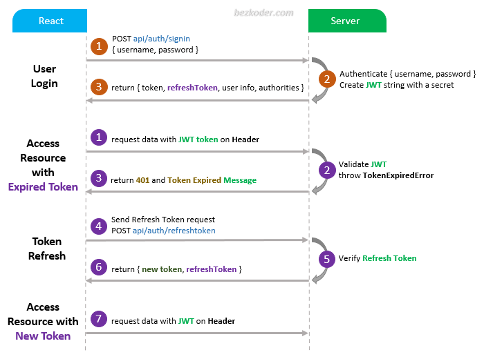

## React Redux Refresh Token with Axios and JWT example



For more detail, please visit:
> [React Redux Refresh Token with Axios and JWT](https://www.bezkoder.com/redux-refresh-token-axios/)

> [React Redux JWT Authentication & Authorization example](https://bezkoder.com/react-redux-jwt-auth/)

> [React Hooks + Redux: JWT Authentication & Authorization example](https://bezkoder.com/react-hooks-redux-login-registration-example/)

This project was bootstrapped with [Create React App](https://github.com/facebook/create-react-app).

### Set port
.env
```
PORT=8081
```

## Note:
Open `src/services/setupInterceptors.js` and modify `config.headers` for appropriate back-end (found in the tutorial).

```js
instance.interceptors.request.use(
  (config) => {
    const token = TokenService.getLocalAccessToken();
    if (token) {
      // config.headers["Authorization"] = 'Bearer ' + token;  // for Spring Boot back-end
      config.headers["x-access-token"] = token; // for Node.js Express back-end
    }
    return config;
  },
  (error) => {
    return Promise.reject(error);
  }
);
```

## Project setup

In the project directory, you can run:

```
npm install
# or
yarn install
```

or

### Compiles and hot-reloads for development

```
npm start
# or
yarn start
```

Open [http://localhost:8081](http://localhost:8081) to view it in the browser.

The page will reload if you make edits.

## Related Posts
> [In-depth Introduction to JWT-JSON Web Token](https://bezkoder.com/jwt-json-web-token/)

> [React.js CRUD example to consume Web API](https://bezkoder.com/react-crud-web-api/)

> [React Redux CRUD App example with Rest API](https://bezkoder.com/react-redux-crud-example/)

> [React Pagination example](https://bezkoder.com/react-pagination-material-ui/)

> [React File Upload with Axios and Progress Bar to Rest API](https://bezkoder.com/react-file-upload-axios/)

Fullstack (JWT Authentication & Authorization example):
> [React + Spring Boot](https://bezkoder.com/spring-boot-react-jwt-auth/)

> [React + Node.js Express](https://bezkoder.com/react-express-authentication-jwt/)

Fullstack CRUD with Node.js Express:
> [React.js + Node.js Express + MySQL](https://bezkoder.com/react-node-express-mysql/)

> [React.js + Node.js Express + PostgreSQL](https://bezkoder.com/react-node-express-postgresql/)

> [React.js + Node.js Express + MongoDB](https://bezkoder.com/react-node-express-mongodb-mern-stack/)

Fullstack CRUD with Spring Boot:
> [React.js + Spring Boot + MySQL](https://bezkoder.com/react-spring-boot-crud/)

> [React.js + Spring Boot + PostgreSQL](https://bezkoder.com/spring-boot-react-postgresql/)

> [React.js + Spring Boot + MongoDB](https://bezkoder.com/react-spring-boot-mongodb/)

Fullstack CRUD with Django:
> [React.js + Django Rest Framework](https://bezkoder.com/django-react-axios-rest-framework/)

Integration (run back-end & front-end on same server/port)
> [How to integrate React.js with Spring Boot](https://bezkoder.com/integrate-reactjs-spring-boot/)

> [Integrate React with Node.js Express on same Server/Port](https://bezkoder.com/integrate-react-express-same-server-port/)

Serverless:
> [React Firebase CRUD App with Realtime Database](https://bezkoder.com/react-firebase-crud/)

> [React Firestore CRUD App example | Firebase Cloud Firestore](https://bezkoder.com/react-firestore-crud/)
